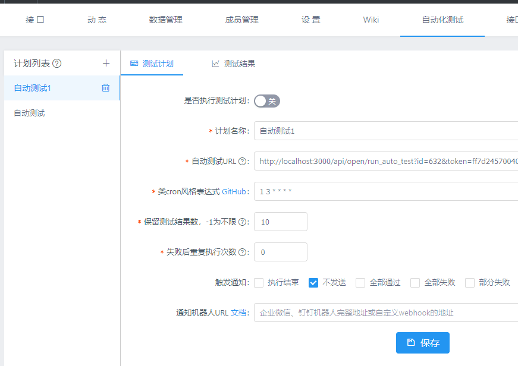

yapi-plugin-auto-test
===

在分组的项目导航栏中加入*自动化测试*标签，支持直接在项目中设置服务端测试计划。使用过程中如果碰到任何bug或有任何好的的建议欢迎issue。

### 安装

第一步：在config.json这层目录下运行 ```yapi plugin --name yapi-plugin-auto-test```安装插件

第二步：如果配置代理转发可能导致无法正确获取到host的情况下，请修改config.json的配置。默认可以忽略
```json
{
    "name": "auto-test",
    "options": {
      "host": "http://localhost:3000"
    }
}
```

第三步： 重启服务器

### 使用

#### 测试计划



用户可以自定义多个测试计划，根据对应的设置项进行测试计划的设置。

通知机器人支持目前支持企业微信机器人、钉钉机器人以及自定义webhook，如果url为空则不发送通知，邮件通知不受触发通知影响。如果是企业微信或钉钉机器人直接复制机器人地址即可。

#### 测试结果


时间轴风格的测试结果列表，支持直接查看历史测试结果。注意：测试结果页面的清空会直接**清空**当前计划的历史测试结果，谨慎操作。


### 更新

通过yapi-cli更新插件还是比较麻烦的，直接再执行一次命令并不会更新。因为yapi-cli安装插件实际上就是在vendors目录下执行`npm install --registry https://registry.npm.taobao.org yapi-plugin-auto-test`，所以最后会在package.json文件中记录下开始安装的版本号，再次执行安装的还是同一个版本。

执行如下操作可以进行更新：
1. 需要先清除ykit的缓存，删除`./vendors/node_modules/.ykit_cache`文件夹
2. 修改package.json里面`yapi-plugin-auto-test`的版本或者直接`npm i yapi-plugin-auto-test@version`
3. 在`./vendors/`目录中执行命令`NODE_ENV=production ykit pack -m`
4. 在config.json这层目录下执行命令`yapi plugin --name yapi-plugin-auto-test`后再重启服务器就完成安装指定版本的插件

### 注意事项

1. 企业微信每个机器人发送的消息不能超过20条/分钟，最新内容参考[消息发送频率限制](https://work.weixin.qq.com/api/doc/90000/90136/91770#%E6%B6%88%E6%81%AF%E5%8F%91%E9%80%81%E9%A2%91%E7%8E%87%E9%99%90%E5%88%B6)。
2. 钉钉每个机器人每分钟最多发送20条，参考[消息发送频率限制](https://ding-doc.dingtalk.com/doc#/serverapi2/qf2nxq)。

### ChangeLog

#### v1.0.1

* 结果通知支持更多方式

#### v1.0.0

* 修复重名校验问题，只校验当前项目
* 增加接口权限控制

#### v0.0.6

* 触发通知条件支持复选

#### v0.0.5

* 任务执行失败支持自动重试，重试期间中断定时执行，重试结束之后恢复定时任务

#### v0.0.4

* 支持config.json中传配置

#### v0.0.2

* 新增自定义通知，支持企业微信通知
* 为保证token安全，从测试结果通知中移除token
